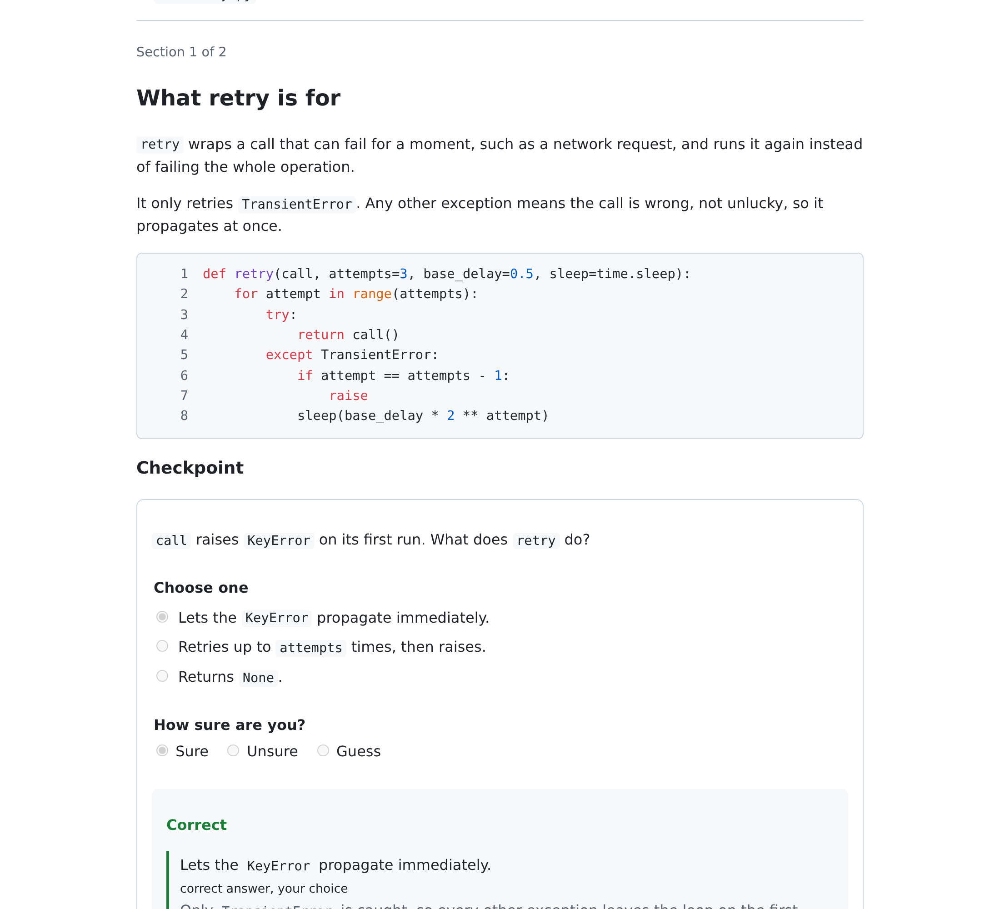
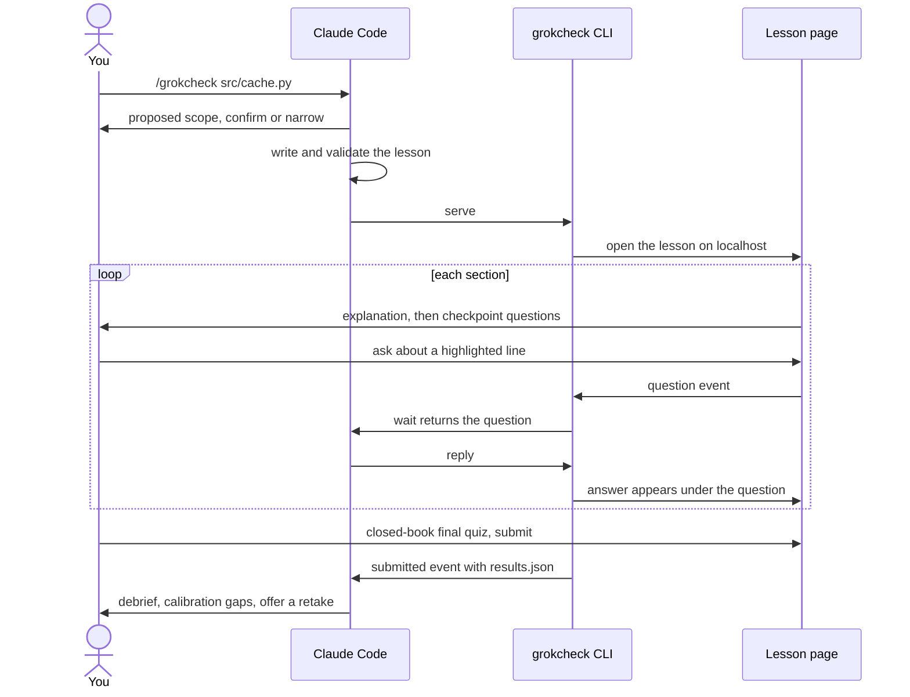

# grokcheck

[](https://github.com/Tsadoq/grokcheck/actions/workflows/ci.yml)
[](LICENSE)


**Check that you actually understand the code your agent just wrote.**

When an agent writes code for you, it is easy to accept a change you do not really understand, and a few weeks later you cannot explain what your own repository does. Reading the diff line by line is slow, and nothing tells you whether what you think you understood is actually right.

grokcheck is a Claude Code plugin that turns a piece of code into an interactive lesson in your browser. Each section is gated behind checkpoint questions, the agent answers your questions live while you read, and a closed-book final quiz shows where your confidence was misplaced.



## Highlights

- **You cannot skim past it.** Every section ends in checkpoint questions, and the next section stays locked until you answer them.
- **Questions shaped like code.** Beyond single and multiple choice: predict the output, pick the buggy line, put the steps in order, fill in the blank, and explain in your own words.
- **Calibration, not just a score.** You rate how sure you are before every answer is revealed, and the debrief starts with the answers you were sure about and got wrong.
- **Ask while you read.** Highlight any line and ask about it. The agent answers under your question, with that section as context.
- **Lessons stay with the code.** Every lesson, answer and reply is saved in the project as JSON plus a readable Markdown export, so you can revisit it months later.
- **Nothing to install.** The CLI and server use only the Python standard library, and the page is plain HTML, CSS and JavaScript with no build step.

### Question types

| Type | What you do |
|------|-------------|
| Single choice | Pick the one right answer |
| Multiple choice | Pick every answer that applies |
| Predict the output | Say what a snippet prints or returns |
| Pick the line | Click the line that causes the bug or does the work |
| Order the steps | Put the steps of a flow in the order they run |
| Fill the blank | Type the missing expression in a snippet |
| Open answer | Explain in your own words, then rate yourself against a rubric |

Closed questions are graded in the browser against the answer key. Open answers and unmatched fill-the-blank answers are re-graded by the agent after you submit.

## How a session works



## Install

grokcheck needs Python 3.11 or newer and a browser. The skill uses only the standard library, so there is nothing else to install.

The repository is a plugin and its own marketplace. Inside Claude Code:

```
/plugin marketplace add tsadoq/grokcheck
/plugin install grokcheck@grokcheck-marketplace
```

The same from a shell:

```sh
claude plugin marketplace add tsadoq/grokcheck
claude plugin install grokcheck@grokcheck-marketplace
```

To develop grokcheck, add your local checkout as the marketplace instead, so your edits are what gets installed:

```
/plugin marketplace add /path/to/grokcheck
/plugin install grokcheck@grokcheck-marketplace
```

Check the manifests before publishing a change:

```sh
claude plugin validate .
```

## Permissions

The skill pre-approves its CLI through `allowed-tools`, but Claude Code clears that grant at your next message. A lesson runs across many messages (you ask questions, the agent waits in the background, you submit), so without a standing rule you would be prompted for every `wait` and `reply`.

Add one rule, once, to `.claude/settings.json` in the project (or to `~/.claude/settings.json` to cover every project). Replace `/home/you` with your home directory; the `*` in the path matches any installed version:

```json
{
  "permissions": {
    "allow": [
      "Bash(python3 /home/you/.claude/plugins/cache/grokcheck-marketplace/grokcheck/*/skills/grokcheck/grokcheck *)"
    ]
  }
}
```

The rule covers only the grokcheck CLI, and matches every call the skill makes because [SKILL.md](skills/grokcheck/SKILL.md#running-commands) keeps each call in that one form. When you run a local checkout, point the rule at `/path/to/grokcheck/skills/grokcheck/grokcheck` instead.

## Usage

Name the code you want to understand:

```
/grokcheck src/cache.py
/grokcheck src/storage/
/grokcheck main~3..main
/grokcheck last change
```

`last change` (or no argument) means your uncommitted changes, or the last commit when the tree is clean. The agent tells you which files and behaviour the lesson will cover and waits for you to confirm or narrow it; a lesson aims for 15 to 30 minutes, and a larger scope is split. You can also just ask in plain words, such as "explain what you just wrote and quiz me".

Work through the page at your own pace. Highlight any text and ask about it, or use the Ask box; the answer appears under your question while you keep reading. You can still talk to the agent in the chat meanwhile. After you submit the final quiz, the agent re-grades your free-text answers, points out the questions you were sure about and got wrong, explains each miss against the code, and offers a retake of what you missed.

### Where lessons are stored

Each lesson lives in the project you studied, under `.grokcheck/lessons/<lesson-id>/`:

| File | Contents |
|------|----------|
| `lesson.json` | The lesson, with the code it quotes frozen at serve time |
| `events.jsonl` | Every answer, question, reply and submit, in order |
| `results.json` | Graded answers, your confidence ratings and the answer keys |
| `lesson.md` | The explanation, your questions with their replies, and your results, readable on their own |
| `session.json` | The server port and access token, readable only by you |

grokcheck writes `.grokcheck/.gitignore` containing `*`, so nothing is committed by default. To share a lesson with your team, commit its readable export and leave the rest ignored:

```sh
git add -f .grokcheck/lessons/<lesson-id>/lesson.md
```

To commit whole lesson folders from now on, replace the ignore file so that only the files holding the access token stay out:

```sh
printf 'session.json\ndraft.json\n' > .grokcheck/.gitignore
```

grokcheck only creates `.grokcheck/.gitignore` when it is missing, so your version is kept.

### Over SSH

The lesson server listens on `127.0.0.1` only. When Claude Code runs on a remote machine, ask the agent to serve on a fixed port without opening a browser, for example "run grokcheck on src/cache.py, serve it with `--port 8765 --no-open`". Then forward that port from your own machine:

```sh
ssh -L 8765:127.0.0.1:8765 you@remote-host
```

and open the `url` the agent gives you in your local browser. The server accepts a different local port too, so `-L 9000:127.0.0.1:8765` works if 8765 is taken locally; change the port in the URL to match.

## Development

```sh
uv sync
uv run pytest
node --test tests/js/
uv run ruff check .
uv run ruff format --check .
uv run mypy skills/grokcheck/grokcheck tests
```

`uv run pytest` runs the Python unit tests; `node --test tests/js/` runs the tests of the browser's pure modules (Node 20 or newer). Ruff (every rule enabled) and strict mypy are held clean across the repository, and CI runs all of the above plus the end-to-end test on every push.

One end-to-end test drives a full lesson through a real Chromium. It is marked `e2e` and left out of the default run, because it needs a browser download first:

```sh
uv run playwright install chromium
uv run pytest -m e2e tests/e2e
```

In a bare container Chromium also needs system libraries; install them once as root with `uv run playwright install-deps chromium`.

The skill itself is `skills/grokcheck/`: `SKILL.md` is what the agent follows, `grokcheck/` is the CLI and server, `web/` is the lesson page, and `references/` holds the lesson format, the authoring guide and a complete example lesson.

## Contributing

Issues and pull requests are welcome. See [CONTRIBUTING.md](CONTRIBUTING.md) for how the project is laid out and what a change needs before it is merged.

## License

MIT, see [LICENSE](LICENSE).
