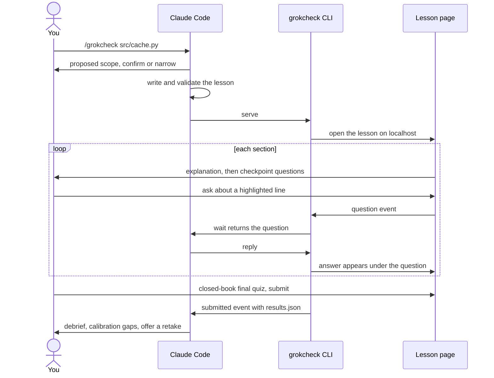

# grokcheck

[](https://github.com/Tsadoq/grokcheck/actions/workflows/ci.yml)
[](LICENSE)


**Check that you actually understand the code your agent just wrote.**

When an agent writes code for you, it is easy to accept a change you do not really understand, and a few weeks later you cannot explain what your own repository does. Reading the diff line by line is slow, and nothing tells you whether what you think you understood is actually right.

grokcheck is a Claude Code plugin that turns a change, an area of code, a library, a choice between options or a document into an interactive lesson in your browser. Each section is gated behind checkpoint questions, every claim is checked against the code before you see it, the agent answers your questions live while you read, and a closed-book final quiz shows where your confidence was misplaced.


## Highlights

- **You cannot skim past it.** Every section ends in checkpoint questions, and the next section stays locked until you answer them.
- **Questions shaped like code.** Beyond single and multiple choice: predict the output or the next state, pick the buggy line, find which tests a mutant breaks, fix it yourself, assemble code from shuffled lines, and explain in your own words.
- **Seen running, not only read.** Recorded traces you step through, annotated diffs, diagrams, what-if playgrounds and small experiments run against your pinned library versions, with the result held back until you predict it.
- **Checked before you read it.** A separate agent that sees only the cited lines judges every claim in the lesson, and contradicted claims are rewritten before the lesson is served.
- **Calibration, not just a score.** You rate how sure you are before every answer is revealed, and the debrief starts with the answers you were sure about and got wrong.
- **Ask while you read.** Highlight any line and ask about it. The agent answers under your question, with that section as context, or asks you guiding questions in Socratic mode.
- **Misses come back.** What you got wrong is re-tested after 1, 3, 7, 21 and 60 days, and can be exported as Anki cards or an Obsidian note.
- **Lessons stay with the code.** Every lesson, answer and reply is saved in the project as JSON plus a readable Markdown export, so you can revisit it months later.
- **Nothing to install.** The CLI and server use only the Python standard library, and the page is plain HTML, CSS and JavaScript with no build step. Slides and videos live in a separate, optional skill.

### Question types

| Type | What you do |
|------|-------------|
| Single choice | Pick the one right answer |
| Multiple choice | Pick every answer that applies |
| Predict the output | Say what a snippet prints or returns |
| Pick the line | Click the line that causes the bug or does the work |
| Order the steps | Put the steps of a flow in the order they run |
| Fill the blank | Type the missing expression in a snippet |
| Open answer | Explain in your own words, then rate yourself against a rubric |
| Predict the state | With a trace on screen, say what the next step holds before it is shown |
| Mutation quiz | See a one-line change and tick the tests that fail on it |
| Fix the bug | Repair a planted bug; the server runs the tests to grade it |
| Change impact | Tick the callers or tests a proposed change affects |
| Parsons | Assemble code from shuffled lines, leaving out the distractors, and indent it |

Closed questions are graded on the server against the answer key, which reaches the page only after you answer. Open answers and unmatched fill-the-blank answers are re-graded by the agent after you submit.

## What a lesson contains

The subject sets the order of the sections:

| Subject | Sections, in order |
|---------|--------------------|
| A change | What was there and why it had to change, the change as an annotated diff, what can break |
| An area of code | What it is for, the mental model, one request followed end to end, why-decisions, gotchas |
| A concept | A trace of it running with predictions before each step, practice, then your own explanation |
| A library | Its vocabulary next to yours, design intent before API, edge behaviour shown by experiments, what it already provides |
| Options | Your own options and criteria first, then the options compared on fixed criteria, what breaks under each, the assumptions checked |
| A decision already made | What was chosen and why, the assumptions it rests on, a pre-mortem, a teach-back |
| A document | The claim first, then its evidence and method, its limits, and what would change the conclusion |

Each section is prose plus any of these elements, followed by its checkpoint questions:

| Element | What you see |
|---------|--------------|
| Code | The lines the section is about |
| Diff | One hunk of a change, with notes you click to highlight their lines and a prepared question per line |
| Vocabulary | The names you need, each marking its lines in the code when clicked |
| Trace | A stepper over a recorded run: current line, state, narration, and a watch mode that reads it aloud |
| Spike | A small experiment against your pinned versions, its result hidden until you predict it |
| Playground | Sliders over a recorded state table, with tasks you complete by reaching a state |
| Diagram | A Mermaid diagram in the page's colours |
| Options | A comparison table, optionally shown only after you list your own options |
| Assumptions | The claims a choice rests on, each rated by how sure you are |
| Video | A narrated concept video made with `grokcheck-media`, with captions |

Every lesson also says why it looks the way it does: the plan lists the media used and the ones left out. You can switch between a short and a detailed view at any time.

## How a session works



## How it works


The full narrated tour (2 min 43 s, three chapters) is attached to the [0.2.0 release](https://github.com/Tsadoq/grokcheck/releases/tag/v0.2.0), with captions in [docs/grokcheck-tour.vtt](docs/grokcheck-tour.vtt). The media skill made it from the lesson below, so you can rebuild it yourself.

[docs/lessons/grokcheck-tour.json](docs/lessons/grokcheck-tour.json) is a 15-minute grokcheck lesson about grokcheck, written with grokcheck from this README, [SKILL.md](skills/grokcheck/SKILL.md) and the [research notes](research/README.md). Its claims quote ingested copies of those three files, so ingest them in this order before you serve it:

```sh
python3 skills/grokcheck/grokcheck ingest README.md skills/grokcheck/SKILL.md research/README.md --project .
python3 skills/grokcheck/grokcheck serve docs/lessons/grokcheck-tour.json --project .
```

To rebuild the tour as a narrated video, run the media skill on the served lesson folder: `video plan --minutes 4 --chapter-minutes 1`, then `video chapter` for each chapter and `video join` (see [Slides and videos](#slides-and-videos) for the tools these need).

## Install

grokcheck needs Python 3.11 or newer and a browser. The skill uses only the standard library, so there is nothing else to install; a few commands use tools you may already have (see [Core and optional tools](#core-and-optional-tools)).

The repository is a plugin and its own marketplace. Inside Claude Code:

```
/plugin marketplace add tsadoq/grokcheck
/plugin install grokcheck@grokcheck-marketplace
```

The same from a shell:

```sh
claude plugin marketplace add tsadoq/grokcheck
claude plugin install grokcheck@grokcheck-marketplace
```

To develop grokcheck, add your local checkout as the marketplace instead, so your edits are what gets installed:

```
/plugin marketplace add /path/to/grokcheck
/plugin install grokcheck@grokcheck-marketplace
```

Check the manifests before publishing a change:

```sh
claude plugin validate .
```

## Permissions

The skill pre-approves its CLI through `allowed-tools`, but Claude Code clears that grant at your next message. A lesson runs across many messages (you ask questions, the agent waits in the background, you submit), so without a standing rule you would be prompted for every `wait` and `reply`.

Add one rule, once, to `.claude/settings.json` in the project (or to `~/.claude/settings.json` to cover every project). Replace `/home/you` with your home directory; the `*` in the path matches any installed version:

```json
{
  "permissions": {
    "allow": [
      "Bash(python3 /home/you/.claude/plugins/cache/grokcheck-marketplace/grokcheck/*/skills/grokcheck/grokcheck *)"
    ]
  }
}
```

The rule covers only the grokcheck CLI, and matches every call the skill makes because [SKILL.md](skills/grokcheck/SKILL.md#running-commands) keeps each call in that one form. When you run a local checkout, point the rule at `/path/to/grokcheck/skills/grokcheck/grokcheck` instead. If you use the media skill, add the same rule for `.../skills/grokcheck-media/grokcheck_media *`.

## Usage

Name what you want to understand:

```
/grokcheck last change
/grokcheck main~3..main
/grokcheck src/storage/
/grokcheck src/cache.py why does a read move the key?
/grokcheck httpx
/grokcheck redis vs sqlite for the job queue
/grokcheck docs/adr/0007-event-bus.md
/grokcheck papers/raft.pdf
```

The agent guesses the subject from what you typed: a change (a commit range, or `last change`, which means your uncommitted changes or the last commit when the tree is clean), an area of code (a directory), a concept (files followed by a question), a library (a package your project pins), options to choose between (`vs`, "should we"), or a decision already made (a merged change or decision record). A paper, guideline or web page is copied into the project as text first, so the lesson can cite its lines. You can also just ask in plain words, such as "explain what you just wrote and quiz me".

Before writing anything, the agent shows the subject, the files and a time budget of 5, 15 or 30 minutes, and waits for you to confirm or correct any of them. A 5-minute lesson is one diff or trace and three hard questions; a scope too large for 30 minutes is split, most important part first. The subject decides the shape: a change starts from context and compares what changed with what you would expect, a library starts from its vocabulary and design intent, options ask for your own options and criteria before showing any.

Subagents write the sections in parallel, record traces and run small experiments against your pinned library versions. Before the lesson is served, a separate subagent that has seen nothing but the evidence checks every claim against the lines it cites, and any claim the evidence contradicts is rewritten. The page opens with one or two questions on what the lesson assumes you know; a wrong answer starts you in the detailed view, and you can switch between short and detailed at any time.

Work through the page at your own pace. Highlight any text and ask about it, or use the Ask box; the answer appears under your question while you keep reading. Tick Socratic mode to be asked guiding questions instead of told. You can still talk to the agent in the chat meanwhile. After you submit the final quiz, the agent re-grades your free-text answers, points out the questions you were sure about and got wrong, explains each miss against the code, and offers a retake of what you missed.

### Re-tests, exports and refresh

Submitting a lesson schedules every missed or confident-wrong question for a re-test after 1, 3, 7, 21 and 60 days. A right answer moves it one step up the ladder, a wrong one sends it back to 1 day. Ask the agent what is due; it runs `grokcheck due`, which also lists the questions whose cited code changed since the lesson, and `grokcheck due --serve` serves the due questions as one retake.

To keep the misses outside grokcheck, ask for an export: `grokcheck export <lesson-id> --format anki` writes a tab-separated file Anki imports, and `--format obsidian --vault <folder>` writes one new note into an Obsidian vault without touching the notes already there.

To share a lesson with someone who has no grokcheck, `grokcheck export <lesson-id> --format html [--out <file>]` writes the lesson page as one HTML file that opens from disk with no server: the same design, gates, diagrams, stepper, videos, final quiz and debrief, graded in the browser. The file carries the answer keys, so give it to readers, not to people you are testing. Asking questions, Socratic mode and the agent's re-grading of free-text answers need the agent and do not work offline, and mutation and fix-the-bug questions, which run the project's tests, are shown as skipped and left out of the score. Videos are re-encoded at 720p, or left out with their transcript kept, when the file would pass 14 MB. `--fragment` writes the page without the document tags, for a host page that wraps it.

When the code or the discussion has moved on since a lesson, ask the agent to refresh it. `grokcheck refresh` reruns the lesson's experiments and reports which claims no longer match the code, so only those sections are rewritten.

### Where lessons are stored

Each lesson lives in the project you studied, under `.grokcheck/lessons/<lesson-id>/`:

| File | Contents |
|------|----------|
| `lesson.json` | The lesson, with the code it quotes frozen at serve time |
| `events.jsonl` | Every answer, question, reply and submit, in order |
| `results.json` | Graded answers, your confidence ratings and the answer keys |
| `lesson.md` | The explanation, your questions with their replies, and your results, readable on their own |
| `session.json` | The server port and access token, readable only by you |

grokcheck writes `.grokcheck/.gitignore` containing `*`, so nothing is committed by default. To share a lesson with your team, commit its readable export and leave the rest ignored:

```sh
git add -f .grokcheck/lessons/<lesson-id>/lesson.md
```

To commit whole lesson folders from now on, replace the ignore file so that only the files holding the access token stay out:

```sh
printf 'session.json\ndraft.json\n' > .grokcheck/.gitignore
```

grokcheck only creates `.grokcheck/.gitignore` when it is missing, so your version is kept.

### Over SSH

The lesson server listens on `127.0.0.1` only. When Claude Code runs on a remote machine, ask the agent to serve on a fixed port without opening a browser, for example "run grokcheck on src/cache.py, serve it with `--port 8765 --no-open`". Then forward that port from your own machine:

```sh
ssh -L 8765:127.0.0.1:8765 you@remote-host
```

and open the `url` the agent gives you in your local browser. The server accepts a different local port too, so `-L 9000:127.0.0.1:8765` works if 8765 is taken locally; change the port in the URL to match.

## Core and optional tools

The `grokcheck` skill is the core: it needs only Python and a browser, and never imports anything outside the standard library. A few of its commands call tools that a development machine usually has, and say so when one is missing:

| Tool | Used by |
|------|---------|
| git | diffs, mutations, the scope guess, and the staleness check of re-tests and refresh |
| uv | experiments (spikes) against pinned library versions, each in its own throwaway environment |
| podman or docker | experiments that use a package your project does not already lock; without one they are refused, never run on the host |
| pdftotext | reading a PDF you ask about; without it the agent transcribes the PDF itself |
| mmdc | rendering diagrams during the diagram check; without it only the static warnings run |

Experiments and mutations never run in your working tree: spikes run in `.grokcheck/spikes/`, and mutations in a scratch git worktree.

Everything that needs heavier tools lives in the optional `grokcheck-media` skill, which ships in the same plugin. The core never imports it.

## Slides and videos

`grokcheck-media` turns a lesson you already ran into media that outlives the browser session. It does not trigger on its own; ask for it by name, for example `/grokcheck-media .grokcheck/lessons/<lesson-id> deck`.

The video tools live in their own Python environment, the media venv, so the core keeps no dependencies. The first time you make a lesson, the agent asks once whether to install them. A yes runs `setup` in the background while the lesson is written, and the lesson's sections get a one-minute narrated video each when setup finishes in time; otherwise the videos come with the next lesson. A no is remembered, and the agent does not ask again unless you ask for video. To install them yourself:

```sh
python3 skills/grokcheck-media/grokcheck_media setup
```

It needs [uv](https://docs.astral.sh/uv/) and takes a few minutes and about 2.3 GB of disk: Manim, Kokoro speech, faster-whisper, Playwright Chromium and a static ffmpeg, at pinned versions. Inside Claude Code it installs into the plugin's data folder, `$CLAUDE_PLUGIN_DATA/media/`, which survives plugin updates; from a checkout it uses `~/.cache/grokcheck/`. Running it again only fills what is missing, and after an update that changes the pinned versions it brings the venv up to date. Every media command runs itself under the media venv once it exists, so there is nothing to activate.

| Command | Makes | Needs |
|---------|-------|-------|
| `setup` | The media venv, the Kokoro voice files and the speech recognition model; `setup --decline` records a no | uv |
| `doctor` | The media venv's state (`ready`, `missing`, `out_of_date` or `declined`) and which optional tools are installed | nothing |
| `export reveal` | A reveal.js deck, one slide per section, checkpoints as speaker notes, opening offline from disk | nothing (reveal.js is vendored) |
| `render stepper` | A narrated MP4 of a trace's steps | ffmpeg, Playwright Chromium |
| `video plan`, `video chapter`, `video join` | A narrated concept video in chapters, each checked against the code it cites and cached, which a lesson can embed as a video element | ffmpeg, Manim or HyperFrames, faster-whisper, Kokoro (or ElevenLabs when you allow cloud speech) |

Run `doctor` first: it maps each tool to its path, or `null` when it is missing. A command whose tool is missing prints what to install and stops; only `setup` installs anything.

## Development

```sh
uv sync
uv run pytest
node --test tests/js/*.test.mjs
uv run ruff check skills tests
uv run ruff format --check skills tests
uv run mypy skills/grokcheck/grokcheck skills/grokcheck-media/grokcheck_media tests
python3 skills/grokcheck/grokcheck validate skills/grokcheck/references/example-lesson.json --project . --strict
```

`uv run pytest` runs the Python unit tests of both skills; the media tests use no external tool. `node --test tests/js/*.test.mjs` runs the tests of the browser's pure modules (Node 20 or newer). Ruff (every rule enabled) and strict mypy are held clean over the skills and tests, and CI runs all of the above plus the end-to-end test on every push.

One end-to-end test drives a full lesson through a real Chromium. It is marked `e2e` and left out of the default run, because it needs a browser download first:

```sh
uv run playwright install chromium
uv run pytest -m e2e tests/e2e
```

In a bare container Chromium also needs system libraries; install them once as root with `uv run playwright install-deps chromium`.

The core skill is `skills/grokcheck/`: `SKILL.md` is what the agent follows, `grokcheck/` is the CLI and server, `web/` is the lesson page, and `references/` holds the lesson format, the authoring guide and a complete example lesson. The media skill is `skills/grokcheck-media/`, with its CLI in `grokcheck_media/` and the vendored reveal.js in `vendor/`.

## Contributing

Issues and pull requests are welcome. See [CONTRIBUTING.md](CONTRIBUTING.md) for how the project is laid out and what a change needs before it is merged.

## License

MIT, see [LICENSE](LICENSE).
